# OpenGL_ESGuide
OpenGL ES　应用开发实践指南Android


学习＜OpenGL ES　应用开发实践指南　Android卷＞（美）KevinBrothaler著


## 第1章 准备开始

- 创建GLSurfaceView实例
- 检查系统是否支持OpenGLES  2.0
- 为Open GL2.0配置渲染表面
- 在Acticity 对应生命周期关联glsurfaceview [onPause,onResume]
- 创建渲染器 Renderer类
  - onSurfaceCreate
  - onSurfaceChanged
  - onDrawFrame 
  
  
  
  
## 第2章 定义顶点和着色器

### 定义顶点  

OpenGL里能绘制的图元:点,直线及三角形  

- 添加长方形桌子顶点,由两个三角形组成
- 添加中间线和两个木槌顶点

### 顶点被OpenGL 存取
  
```
 vertexData = ByteBuffer
                //分配一块本地内存，不由垃圾回收器管理.因为每个浮点数４个字节，所以分配内存大小为定点数的４倍
                .allocateDirect(tableVerticesWithTriangles.length * BYTES_PER_FLOAT)
                //告诉字节缓冲区按照本地字节序组织它的内容
                .order(ByteOrder.nativeOrder())
                //得到一个反映底层字节的FloatBuffer类实例，使得无须直接操作字节
                .asFloatBuffer();
        //把数据从Dalvik内存复制到本地内存，当进程结束时，这块内存会被释放掉
 vertexData.put(tableVerticesWithTriangles);

```

### 引入OpenGL 管道

- 顶点着色器
- 片段着色器

#### 创建顶点着色器
着色器使用 GLSL定义:GLSL是OpenGL的着色语言,语言结构与C语言类似
- attribute 把属性放进着色器的手段
#### 创建第一个片段着色器
- 精度限定符 lowp mediump highp
- 生成片段颜色 uniform 

**着色器只是可以运行在GPU上的特殊类型的程序**

### OpenGL颜色模型
OpenGL 使用累加**RGB**颜色模型


## 第3章 编译着色器及在屏幕上绘制

### 加载着色器

#### 从资源中加载文本
- 文件流读取glsl代码 转为String
#### 读入着色器代码

### 加载着色器

#### 创建一个新着色器对象
- glCreateShader 创建对象 返回一个整型值
- 这个整型号值就是OpenGL对象的引用
- 返回0代表对象创建失败

#### 上传和编译着色器源代码
- glShaderSource(shaderObjectId,shaderCode)  把着色器源代码上传到着色器对象里
- .glCompileShader(shaderObjectId)  编译这个着色器

#### 取出编译状态
```
 //检查编译成功/失败,将结果存入数组第0个元素
final int[] compileStatus = new int[1];
GLES20.glGetShaderiv(shaderObjectId,GL_COMPILE_STATUS,compileStatus,0);

```
#### 取出着色器信息日志
- GLES20.glGetShaderInfoLog(shaderObjectId)

#### 验证编译状态并返回着色器对象ID

查看编译是否成功:
```
//结果为0表示编译失败
if (compileStatus[0] == 0){
  //如果失败,删除shader对象
   GLES20.glDeleteShader(shaderObjectId);

if (LoggerConfig.ON){
      Log.w(TAG, "compilation of shader failed");
}
return 0;
```
不成功返回0,成功返回着色器id

### 把着色器链接进OpenGL的程序
#### 理解OpenGL的 程序
简单来说: 一个OpenGL程序就是把一个顶点着色器和一个片段着色器链接在一起变成单个对象

#### 新建程序对象并附上着色器
- 新建程序对象 glCreateProgram() 返回int型 programObjectId
- 附上着色器: 把顶点和片段着色器都附加到程序对象上
   - GLES20.glAttachShader(programObjectId,vertexShaderId);
   - GLES20.glAttachShader(programObjectId,fragmentShaderId);
   
#### 链接程序
- glLinkProgram(programObjectId); 链接程序
- 检查链接成功失败 
```
 //检查链接成功/失败
        final int[] linkStatus = new int[1];
        GLES20.glGetProgramiv(programObjectId,GL_LINK_STATUS,linkStatus,0);
```
- 输出日志 glGetProgramInfoLog(programObjectId)
- 验证链接状态并返回程序对象id
```
...
if (linkStatus[0] == 0){
            GLES20.glDeleteProgram(programObjectId);

            if (LoggerConfig.ON){
                Log.d(TAG, "linking of program failed.");
            }

            return 0;
        }
        //如果程序链接成功,返回
 return programObjectId;
```

### 做最后拼接
#### 验证OpenGL程序的对象
- 验证程序
```
//验证对应id指定的程序
GLES20.glValidateProgram(programObjectId);

final int[] validateStatus = new int[1];
//用GL_VALIDATA_STATUS作为参数调用glGEtProgramiv()方法检查其结果
GLES20.glGetProgramiv(programObjectId,GL_VALIDATE_STATUS,validateStatus,0);
Log.d(TAG, "Results of validating program:" + validateStatus[0] +"\nLog:"
                + GLES20.glGetProgramInfoLog(programObjectId));

return validateStatus[0] != 0;
```
- 使用程序 glUseProgram(program)

#### 获得一个uniform位置
```
//获取uniform - u_Color位置(res/raw/simple_fragment_shader.glsl中定义)
uColorLocation = GLES20.glGetUniformLocation(program,U_COLOR);
```
#### 获取属性位置
```
//获取attribute - a_Position位置(res/raw/simple_vertex_shader.glsl中定义)
aPositionLocation = GLES20.glGetAttribLocation(program,A_POSITION);
```
#### 关联属性与顶点数据数组
```
//保证OpenGL从缓冲区读取时,它会从开头(0)位置开始读取
vertexData.position(0);
//告诉OpenGL,可以在缓冲区vertexData中找到a_Position对应的数据(关联属性与顶点数据的数组)
GLES20.glVertexAttribPointer(aPositionLocation,POSITION_COMPONENT_COUNT,GLES20.GL_FLOAT,
                false,0,vertexData);
```
#### 使能顶点数组
- glEnableVertexAttribArray(aPositionLocation)

### 在屏幕上绘制
#### 绘制桌子
```
 // 绘制球桌 
 // 更新着色器代码中的u_color值.
 // 与属性不同,uniform没有默认值.所以我们提供4个分量(r:1;g:1;b:1;a:1)绘制为白色
 GLES20.glUniform4f(uColorLocation,1.0f,1.0f,1.0f,1.0f);
 // 绘制2个三角形,从数组0位置开始读取6个顶点
 GLES20.glDrawArrays(GLES20.GL_TRIANGLES,0,6); 
```
#### 绘制分割线
```
//绘制中间线
//红色
GLES20.glUniform4f(uColorLocation,1.0f,0f,0f,1.0f);
//从数组6位置开始读取2个顶点 绘制一条线
GLES20.glDrawArrays(GLES20.GL_LINES,6,2);

```

#### 把木槌绘制为点
```
//把木垂绘制为点 蓝色
GLES20.glUniform4f(uColorLocation,0f,0f,1f,1f);
gl.glDrawArrays(GL10.GL_POINTS,8,1);

//把木垂绘制为点 红色
GLES20.glUniform4f(uColorLocation,1f,0f,0f,1f);
gl.glDrawArrays(GL10.GL_POINTS,9,1);
```

#### OpenGL 坐标映射屏幕
暂需知道:OpenGL吧下,y坐标映射到屏幕 范围均为[-1,1]
#### 指定点(木槌)大小
- gl_PointSize = 10.0;(in simple_vertex_shader.glsl)


## 第4章 增加颜色和着色

### 平滑着色
#### 平滑着色是在顶点之间完成的

### 引入三角形扇
```
//绘制一个三角形扇:以第一个顶点作为起始,使用相邻两个顶点创建一个三角形,
// 接下来每个顶点都会创建一个三角形,围绕起始的中心点按扇形展开
GLES20.glDrawArrays(GLES20.GL_TRIANGLE_FAN, 0, 6);
```

### 增加一个新的颜色属性
```
  /* 定义顶点数据 两个三角形组成１个矩形 */
        //OpenGL 会把屏幕映射到[-1,1]
        float[] tableVerticesWithTriangles = {
                /**
                 * p5----------p4
                 * |            |
                 * |            |
                 * |            |
                 * |     p1     |
                 * |            |
                 * |            |
                 * |            |
                 * p2-----------p3
                 * p6
                 *
                 * x,y,r,g,b
                */
                0f,      0f,          1f,1f,1f,//p1 r g b

                -0.5f,-0.5f,        0.7f,0.7f,0.7f,//p2
                0.5f, -0.5f,        0.7f,0.7f,0.7f,//p3

                0.5f, 0.5f,         0.7f,0.7f,0.7f,//p4
                -0.5f, 0.5f,        0.7f,0.7f,0.7f,//p5
                -0.5f, -0.5f,       0.7f,0.7f,0.7f,//p6

                //中间线
                -0.5f, 0f, 1f,0f,0f,
                0.5f, 0f,  1f,0f,0f,

                //两个木槌
                0f, -0.25f, 0f,0f,1f,
                0f, 0.25f,  1f,0f,0f,
        };
```
#### 给着色器增加颜色属性
修改 simle_vertex_shader.glsl 更新新的着色器代码
``` 
attribute vec4 a_Position;
attribute vec4 a_Color; 
varying vec4 v_Color;

void main(){ 
    v_Color = a_Color;

    gl_Position = a_Position; 
    gl_PointSize = 10.0;
}
```
- varying:是一个特殊的变量类型,它把给它的那些值进行混合,并把这些混合后的值发送给片段着色器
把varying 加入片段着色器
```
precision mediump float; 
varying vec4 v_Color;
void main(){
    gl_FragColor = v_Color;
}
```
用varying变量v_Color替换了原来代码中的uniform:
- 如果片段属于一条直线,那么OpenGL就会用构成那条直线的两个顶点计算混合后的颜色;
- 如果那个片段属于一个三角形,那OpenGL就会用构成那个三角形的三个顶点计算其混合后的颜色.

#### 一个varying如何生成每个片段上混合后的颜色?
- 沿着一条直线做线性插值(长度比例确定颜色相对权重)
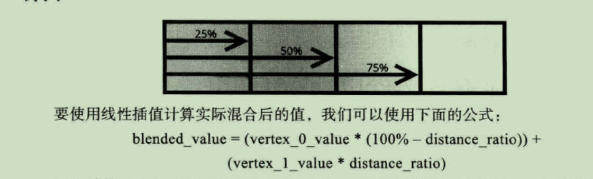

- 在一个三角形表面上混合(面积比例确定颜色相对权重)
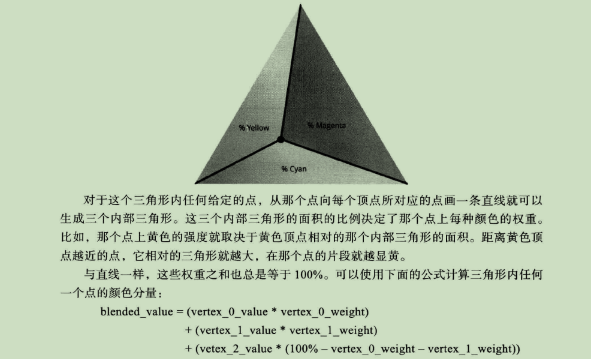


### 用新的颜色属性渲染
#### 更新常量
更新AColor相关常量 及步长stride
```
private static final String A_COLOR = "a_Color";
private static final int COLOR_COMPONENT_COUNT = 3;

private static final int STRIDE = (POSITION_COMPONENT_COUNT + COLOR_COMPONENT_COUNT) * BYTES_PER_FLOAT;
private int aColorLocation;

```
#### 更新onSurfaceCreated()
```
...
//获取新的a_Color属性
aColorLocation = GLES20.glGetAttribLocation(program, A_COLOR);
...
//更新glVertexAttribPointer()调用,加入跨距:
 GLES20.glVertexAttribPointer(aPositionLocation,POSITION_COMPONENT_COUNT,GLES20.GL_FLOAT,
                false,STRIDE,vertexData);
 ...
 
 //把顶点数据与着色器中的a_Color关联起来
vertexData.position(POSITION_COMPONENT_COUNT);
GLES20.glVertexAttribPointer(aColorLocation,COLOR_COMPONENT_COUNT,GLES20.GL_FLOAT,
                false,STRIDE,vertexData);
GLES20.glEnableVertexAttribArray(aColorLocation);
...
```

#### 更新onDrawFrame
- 删除glUniform4f()调用

## 第5章 调整屏幕的宽高比
### 宽高比问题
- 因为实际的视口可能不是一个正方形(如设备分辨率为1280X720,而OpenGL映射的坐标为[-1,1],所以这种情况下图像在宽度上会被拉伸)
#### 适应宽高比
- 如设备宽度为720,高度为1280,我们把宽度映射[-1,1],高度为[-1280/720,1280/720]也即[-1.78,1.78]

### 使用虚拟坐标空间
- 正交投影

### 线性代数基础

#### 向量(vector)
- 一个向量是一个有多个元素的一维数组. 
- 在OpenGL里,一个位置通常是一个四元素向量(x,y,z,w),颜色也是一样(r,g,b,a)

#### 矩阵
- 一个矩阵是一个有多个元素的二维数组
- 在OpenGL里,我们一般使用矩阵作向量投影 或使物体旋转/平移/缩放

#### 矩阵与向量乘法
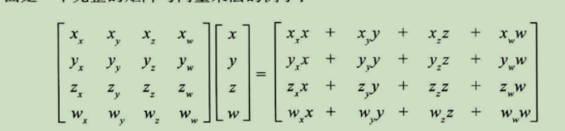

#### 单位矩阵


- 之所以被称为单位举矩阵,是因为这个矩阵乘以任何向量总是得到与原来相同的向量

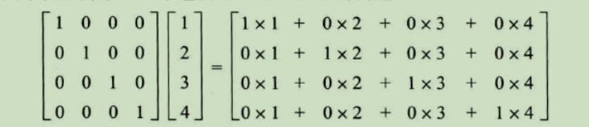

#### 使用平移矩阵
- eg:将位置(2,2)移到(5,5)

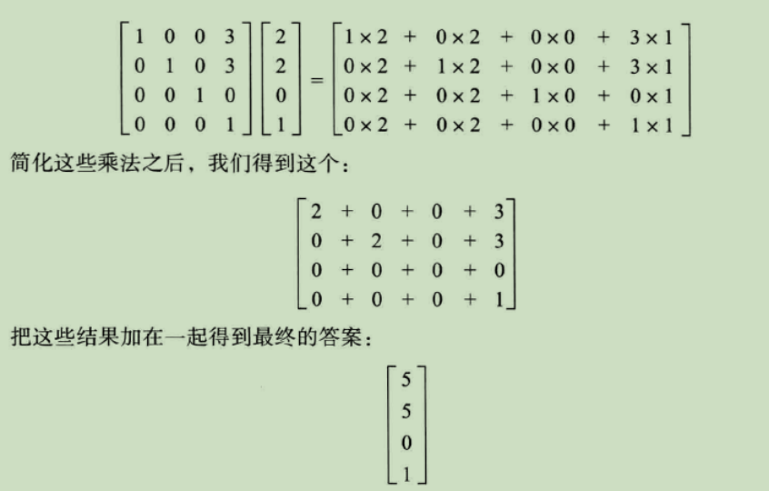


### 定义正交投影
- orthoM方法会为我们生成一个正交投影
```
 orthoM(float[] m, int mOffset,float left, float right, float bottom, float top,float near, float far) 
```
- float[] m: 目标i数组,这个数组的长度至少有16个元素,这样它才能存储正交投影矩阵
- int mOffset: 结果矩阵起始的偏移值
- float left: x轴的最小范围
- float right: x轴的最大范围
- float bottom:  y轴的最小范围
- float top:  y轴的最大范围
- float near:  z轴的最小范围
- float far:  z轴的最大范围
调用该方法后会产生下面的正交投影矩阵:

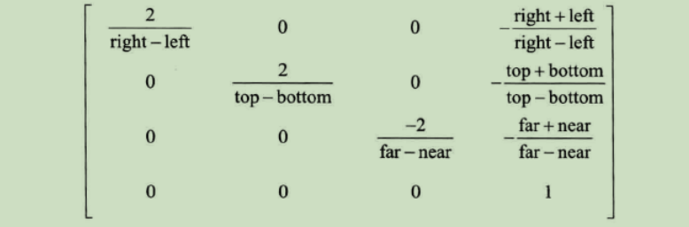

- 左手&右手坐标系统

### 加入正交投影

#### 更新着色器
simple_vertex_shader.glsl:
```
// add 1 mat4 - 4x4矩阵
uniform mat4 u_Matrix; 
attribute vec4 a_Position;
attribute vec4 a_Color; 
varying vec4 v_Color;

void main(){ 
    v_Color = a_Color;
    //add 2
    gl_Position = u_Matrix * a_Position; 
    gl_PointSize = 10.0;
}
```
#### 添加矩阵数组和一个新的uniform

AirHockeyRenderer :
```
 private static final String U_MATRIX = "u_Matrix";
 private final float[] projectionMatrix = new float[16];
 private int uMatrixLocation;
 ...
 
 @Override
 public void onSurfaceCreated(GL10 gl, EGLConfig config){
    ...
    uMatrixLocation = GLES20.glGetUniformLocation(program,U_MATRIX);
    ...
 } 
```

#### 创建正交投影矩阵
```
 @Override
 public void onSurfaceChanged(GL10 gl, int width, int height) {
        //设置视口viewport尺寸
        gl.glViewport(0, 0, width, height);

        final float aspectRatio = width > height ?
                (float)width/(float)height :
                (float)height /(float) width;
        //创建正交投影矩阵
        if (width > height){
            Matrix.orthoM(projectionMatrix,0, -aspectRatio,aspectRatio,-1f,1f,-1f,1f);
        }else {
            Matrix.orthoM(projectionMatrix,0, -1f,1f,-aspectRatio,aspectRatio,-1f,1f);
        }
 } 
```

#### 传递矩阵给着色器
```
 @Override
    public void onDrawFrame(GL10 gl) {
    ...
    //给着色器传递正交投影矩阵
    GLES20.glUniformMatrix4fv(uMatrixLocation,1,false,projectionMatrix,0);
    ...
    }
```


## 第6章 进入第3维

### 三维的艺术
- 线性投影: 工作原理是在一个想象中的消失点处把并行线段聚合在一起,从而创建出立体化的幻想.

### 从着色器到屏幕的坐标变换

gs_Position --> 透视除法 --> 归一化设备坐标 --> 视口变换 --> 窗口坐标

#### 裁剪空间

- 裁剪空间背后逻辑非常简单:对于任何给定的位置,它的x,y及z分量都需要在那个位置的-w 和 w 之间. 任何在这个范围之外的事物在屏幕上都是不可见的.

#### 透视除法

- (x,y,z,w) ---> (x/w,y/w,z/w)
##### 同质化坐标 
eg:(1,1,1,1) (2,2,2,2) (3,3,3,3) ...这些坐标经过透视除法后,所有这些点都映射到归一化设备坐标中的(1,1,1)

##### 除以w的优势
- 为什么不简单的除以z而除以w呢? 我们可以把投影的影响与实际的z坐标解藕,以便我们可以在正交投影和透视投影之间切换.保留z分量作为深度缓冲区.

#### 视口变换
- OpenGL把归一化设备坐标的x和y分量映射到屏幕上的一个区域内,这个区域是操作系统预留出来用于显示的,被称**视口**
- 这些被映射的坐标被称为**窗口坐标**

### 添加w分量创建三维图


### 使用透视投影
- 视椎体 :简单来说视椎体只是1个立方体,其远端比近端大,从而使其变成一个被截断的金字塔. 两端的大小差别越大,观察的范围越宽.我们能看到的也越多.

- 焦点: 一个视椎体,有一个焦点. 这个焦点可以这样得到,顺着从视椎体较大端向较小端扩展出来的那些直线,一直向前通过较小端直到它们汇聚到一起.
- 焦点和视锥体小端的距离被称为**焦距**,它影响视锥体小端和大端的比例,及其对应的视野.

### 定义透视投影

#### 对宽高比和视野进行调整
通用投影矩阵,允许我们调整视野以及屏幕的宽高比:

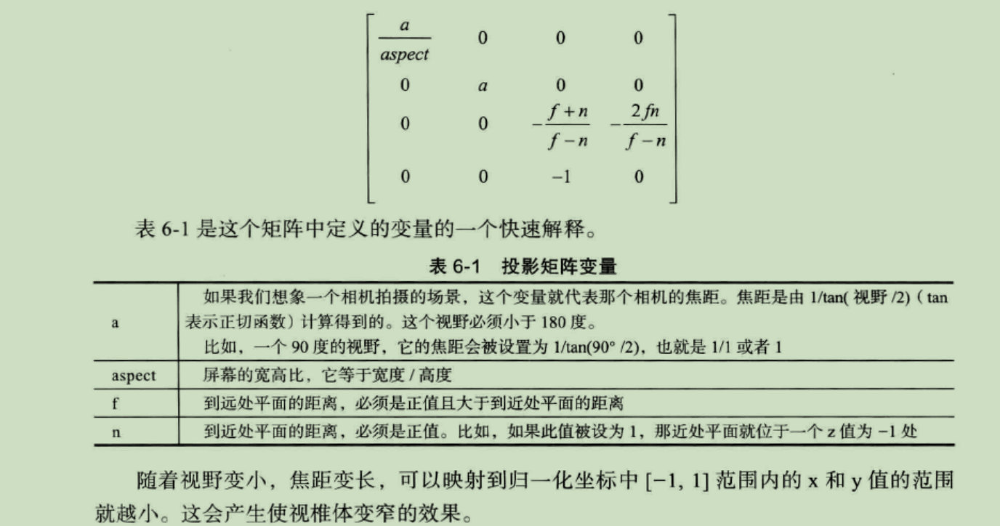


### 在代码里创建投影矩阵
- Android Matrix类准备了两个方法:frustumM()(有缺陷) ,perspectivrM()(>=Android4.0).
- 实现投影矩阵:
airhockey3d/src/main/java/com/ykhe/airhockey3d/util/MatrixHelper.java
```
 public static void perspectiveM(float[] m,float yFovInDegrees,float aspect,float n, float f){ 
        //计算焦距 - 基于在y轴上的视野
        final float angleInRadians = (float)(yFovInDegrees * Math.PI / 180.0);

        final float a = (float) (1.0 / Math.tan(angleInRadians / 2.0));

        //输出矩阵

        m[0] = a / aspect;
        m[1] = 0f;
        m[2] = 0f;
        m[3] = 0f;

        m[4] = 0f;
        m[5] = a;
        m[6] = 0f;
        m[7] = 0f;

        m[8] = 0f;
        m[9] = 0f;
        m[10] = -(f+n)/(f-n);
        m[11] = -1f;

        m[12] = 0f;
        m[13] = 0f;
        m[14] = -(2f*f*n)/(f-n);
        m[15] = 0f;
    }
```

### 开始使用投影矩阵
airhockey3d/src/main/java/com/ykhe/airhockey3d/AirHockeyRenderer.java : 
```
public void onSurfaceChanged(GL10 gl, int width, int height) {
 ...
  //用45度的视野,创建透视投影.z值从-1位置开始到-10位置结束
        MatrixHelper.perspectiveM(projectionMatrix,45,(float)width/(float)height,
                1f,10f);
 ...
}
```

#### 利用模型矩阵移动物体
```
//把模型矩阵设为单位矩阵
 Matrix.setIdentityM(modelMatrix,0);
// 沿着z轴平移-2. 当球桌坐标与这个矩阵坐标相乘时,那些坐标最终会沿着z轴负方向移动2个单位 使能显示在屏幕内
 Matrix.translateM(modelMatrix,0,0f,0f,-2f);
```

#### 更新代码使用一个矩阵(将模型矩阵和透视投影矩阵相乘)
```
//temp 存储投影矩阵与模型矩阵相乘结果
final float[] temp = new float[16];
//调用multiplyMM执行矩阵相乘 结果存入temp
Matrix.multiplyMM(temp,0,projectionMatrix,0,modelMatrix,0);
//将结果存回projectionMatrix
System.arraycopy(temp,0,projectionMatrix,0,temp.length);
```

### 增加旋转
```
//让桌子绕x周旋转60度,造成实际生活中我们站在它面前的效果
 Matrix.translateM(modelMatrix,0,0f,0f,-2.5f);
 Matrix.rotateM(modelMatrix,0,-60f,1f,0f,0f);
```


## 第7章 用纹理增加细节

### 理解纹理
- OpenGL 中的纹理可以用来表示图像,照片,甚至由一个数学算法生成的分形数据
- 每个二维纹理都是由许多小的纹理元素组成,它们是小块的数据,类似于我们前面讨论过的片段和像素
- 要使用纹理最常见的方式是直接从一个图像文件加载数据

每个二维的纹理都有其自己的坐标空间,范围是从一个拐角的(0,0)到另一个拐角(1,1).
按照规定,一个维度叫做S,而另一个称为T.

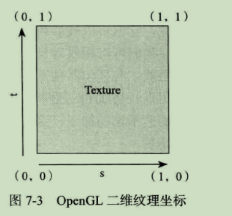


- 对于一个OpenGL纹理来说,它没有内在的方向性,因此可以使用不同的坐标把它定向到任何我们喜欢的方向上.
然而大多数计算机图像都有一个默认的方向,它们通常被规定为y轴向下,y的值随着向图像的底部移动而增加.

- 在OpenGLES 2.0中,纹理不必是正方形,但每个维度都应是2的幂(POT).所以每个维度都是128,256,512这类数字.这样规定的原因在于非POT纹理可以被使用的场合
非常有限,而POT纹理适用于各种情况.

### 把纹理加载进 OpenGL 中
- 第一个任务就是: 把一个图像文件的数据加载到一个OpenGL的纹理之中
新建类:airhockeytextured/src/main/java/com/ykhe/airhockeytextured/util/TextureHelper.java

```
 //把一个图像文件数据加载到一个OpenGL的纹理之中 返回加载图像后的OpenGL纹理的ID
 public static int loadTexture(Context context,int resourceId){
        final int[] textureObjectIds = new int[1];
        //创建1个纹理对象
        GLES20.glGenTextures(1,textureObjectIds,0);
        //检查glGenTextures调用是否成功
        if (textureObjectIds[0] == 0){
            if (LoggerConfig.ON){
                Log.w(TAG,"Could not generate a new OpenGL texture Object");
            }
            return 0;
        }
        ...
 }
```

#### 加载位图数据并与纹理绑定
- 使用Android的API读入图像文件的数据
```
 public static int loadTexture(Context context,int resourceId){
         ...
        //将图像资源解压缩为一个Android位图
        final BitmapFactory.Options options = new BitmapFactory.Options();
        //使用原始的图像数据,而不是这个图像的缩放版本
        options.inScaled = false;

        //将图像资源解码为bitmap 对象
        final Bitmap bitmap = BitmapFactory.decodeResource(context.getResources(),
                resourceId,options);
        if (bitmap == null){
            if (LoggerConfig.ON){
                Log.w(TAG, "" );
            }

            GLES20.glDeleteTextures(1,textureObjectIds,0);
            return 0;
        }
        
        //以2D纹理对待 绑定到textureObjectIds[0] id
        GLES20.glBindTexture(GLES20.GL_TEXTURE_2D,textureObjectIds[0]);  
        ...
 }
```
#### 理解纹理过滤
当纹理大小被扩大或缩小时,我们还需使用**纹理过滤(texture filtering)** 明确说明会发生什么.  
当把几个纹理元素挤进一个片段,缩小就发生了;当把一个纹理元素扩展到许多片段,放大就发生了.
针对每一种情况,都可配置OpenGL使用一个纹理过滤器

##### 两个基本过滤模式
- 最邻近过滤
- 双线性过滤

##### MIP贴图
双线性过滤虽然适合处理放大,但对于缩小到超过一定大小时,就不好用了.为克服这些缺陷,可使用MIP贴图技术.
它可以用来生成一组优化过的不同大小的纹理.

##### 三线性过滤
使用三线性过滤 有助于消除每个MIP贴图级别之间的过渡,得到一个更平滑的图像


#### 设置默认的纹理过滤参数
TextureHelper:
```
loadTexture()-

        // GL_TEXTURE_MIN_FILTER :对于缩小的情况,使用三线性过滤(GL_LINEAR_MIPMAP_LINEAR)
        GLES20.glTexParameteri(GLES20.GL_TEXTURE_2D,GLES20.GL_TEXTURE_MIN_FILTER,GLES20.GL_LINEAR_MIPMAP_LINEAR);
        // GL_TEXTURE_MAG_FILTER :对于放大情况,使用双线性过滤(GL_LINEAR)
        GLES20.glTexParameteri(GLES20.GL_TEXTURE_2D,GLES20.GL_TEXTURE_MAG_FILTER,GLES20.GL_LINEAR);
```

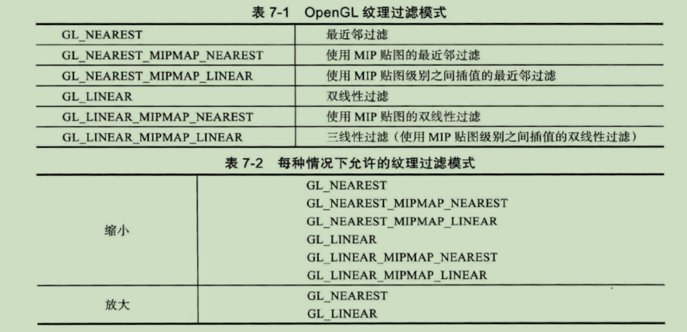

#### 加载纹理到OpenGL并返回其ID
```
//告诉OpenGL读入bitmap定义的位图数据,并把他复制到当前绑定的纹理对象
 GLUtils.texImage2D(GLES20.GL_TEXTURE_2D,0,bitmap,0);

 bitmap.recycle();
 
//生成MIPMAP贴图
GLES20.glGenerateMipmap(GLES20.GL_TEXTURE_2D);
//解除纹理绑定,避免其他纹理方法调用意外的改变这个纹理
GLES20.glBindTexture(GLES20.GL_TEXTURE_2D,0);
```

### 创建新的着色器集合

#### 创建新的定点着色器
 res/raw/texture_vertes_shader.glsl
```
//顶点纹理着色器 
uniform mat4 u_Matrix;

attribute vec4 a_Position;

//有两个分量 S T 所以用vec2定义
attribute vec2 a_TextureCoordinates;
//插值
varying  vec2 v_TextureCoordinates;

void main(){
    v_TextureCoordinates = a_TextureCoordinates;
    gl_Position = u_Matrix * a_Position;
}
```

#### 创建新的片段着色器
 res/raw/texture_fragment_shader.glsl
 ``` 
precision mediump float;
// u_TextureUnit 接受实际的纹理数据
// sampler2D 指一个二维纹理数据的数组
uniform sampler2D u_TextureUnit;
//纹理坐标
varying vec2 v_TextureCoordinates;

void main(){
    //被插值的纹理坐标和纹理数据被传递给着色器函数texture2D(),他会读入纹理中的那个特定坐标出的颜色值,
    //把结果赋值给gl_FragColor设置片段的颜色
    gl_FragColor = texture2D(u_TextureUnit,v_TextureCoordinates);
}

```

### 为顶点数据创建新的类结构

- 将顶点数据分离到不同类中
  VertexArray.java -- 用来封装存储顶点矩阵的FloatBuffer
  Table.java      --   桌子
  Mallet.java     --  木槌
  
  
### 为着色器程序添加类
  ShaderProgram  -- 着色器程序基类
  TextureShaderProgram -- 纹理着色器程序
  ColorShaderProgram --  颜色着色器程序
  
### 绘制纹理
#### 初始化变量
```
//AirHockeyRenderer
...
    @Override
    public void onSurfaceCreated(GL10 gl, EGLConfig config) {
        GLES20.glClearColor(0.0f,0.0f,0.0f,0.0f);

        table = new Table();
        mallet = new Mallet();

        textureProgram = new TextureShaderProgram(context);
        colorProgram = new ColorShaderProgram(context);
        
        //加载纹理
        texture = TextureHelper.loadTexture(context,R.drawable.air_hockey_surface);
    }
```

#### 使用纹理进行绘制
```
//AirHockeyRenderer.java
    @Override
    public void onDrawFrame(GL10 gl) {

        GLES20.glClear(GLES20.GL_COLOR_BUFFER_BIT);

        //绘制桌子
        textureProgram.useProgram();
        textureProgram.setUniforms(projectionMatrix,texture);
        table.bindData(textureProgram);
        table.draw();

        //绘制木槌
        colorProgram.useProgram();
        colorProgram.setUniforms(projectionMatrix);
        mallet.bindData(colorProgram);
        mallet.draw();
    }
```

### 小结
- 纹理不会被直接绘制,它们要被绑定到纹理单元,然后把这些纹理单元传递给着色器

## 第8章 构建简单物体
- 将三角形图元组织成为三角形带/三角形扇,并将它们合并在一起成为一个单一物体
- 定义视图矩阵,并把它集成到我们的矩阵层次结构中

### 合并三角形带和三角形扇
冰球及木槌形状:

- 冰球为一个扁平的圆柱体,由一个顶部圆及圆柱侧面构成:

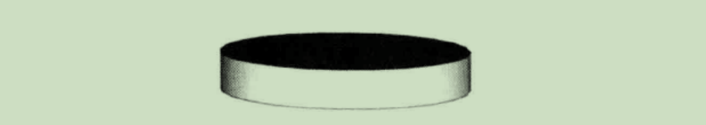


- 木槌由两个圆柱体组成:

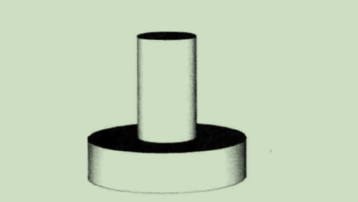

- 构建圆柱侧面,需要知道一个概念-三角形带:

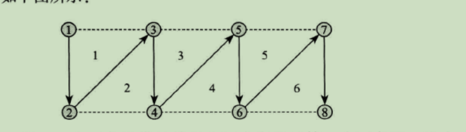

### 添加几何图形的类

-构建冰球: 需要一个三角形扇做顶,一个三角形带做侧面
-构建冰槌: 需要2个三角形扇,2个三角形带

创建Geometry类(util包下),加入点 Point类:
```
  /**
     * 三维场景中的一个点
     */
    public static class Point {
        public final float x, y, z;

        public Point(float x, float y, float z) {
            this.x = x;
            this.y = y;
            this.z = z;
        }
        //沿着y轴平移
        public Point translateY(float distance) {
            return new Point(x, y + distance, z);
        }
    }
```

给圆定义,加入Circle类:

```
//圆形
    public static class Circle{
        public final Point center;
        public final float radius;

        public Circle(Point center,float radius){
            this.center = center;
            this.radius = radius;
        }

        //缩放
        public Circle scale(float scale){
            return new Circle(center,radius * scale);
        }
    }
```
给圆柱体一个定义:,Cylinder类:

```
 public static class Cylinder{
        public final Point center;
        public final float radius;
        public final float height;
        
        //中心,半径,高度
        public Cylinder(Point center,float radius,float height){
            this.center = center;
            this.radius = radius;
            this.height = height;
        }
    }
```

### 添加物体构建器  

创建:com.ykhe.airhockeywithbettermallets.objects.ObjectBuilder
- 计算圆柱顶部顶点数量:
```
 // 圆柱体顶部顶点数量 --
    // 顶部是一个用三角形扇构造的圆,有一个顶点在圆心,围着圆的每个点都有一个顶点,
    // 并且围着圆的地一个顶点要重复两次才能使圆闭合
    private static int sizeOfCircleInVertices(int numPoints){
        return 1 + (numPoints +1);
    }

```
- 圆柱体侧面顶点数量:
```

    // 圆柱体侧面顶点的数量
    // 一个圆柱体是一个卷起来的长方形,由三角形带构造,围着顶部圆的每个点都需要两个顶点
    // 且前两个顶点要重复两次才能使这个管闭合
    private static int sizeOfOpenCylinderInVertices(int numPoints){
        return (numPoints + 1) *2;
    }

```

#### 用圆柱体创建冰球
```
    //创建冰球
    static GeneratedData createPuck(Geometry.Cylinder puck,int numPoints){
        //一个冰球由一个顶部圆和一个圆柱体侧面构成,所以所有顶点数量为它们之和
        int size = sizeOfCircleInVertices(numPoints)
                + sizeOfOpenCylinderInVertices(numPoints);

        ObjectBuilder builder = new ObjectBuilder(size);

        //1.圆形顶部需要被放在冰球的顶部 所以为圆心为圆柱中心点向上移动1/2个高度
        Geometry.Circle puckTop = new Geometry.Circle(
                puck.center.translateY(puck.height/2f),
                puck.radius);

        builder.appendCircle(puckTop,numPoints);
        builder.appendOpenCylinder(puck,numPoints);

        return builder.build();
    }

```
代码中的1 图示:


#### 用三角形扇构造圆
```
  private void appendCircle(Geometry.Circle circle,int numPoints){ 
        //三角形扇的中心点
        vertexData[offset++] = circle.center.x;
        vertexData[offset++] = circle.center.y;
        vertexData[offset++] = circle.center.z;

        //2.围绕circle.center定义的圆心点按扇形展开,并把第一个点绕圆周重复两次考虑在内.

        for (int i = 0; i <= numPoints; i++) {
            float angleInRadians = ((float) i / (float) numPoints)
                    * ((float) Math.PI * 2f);


            vertexData[offset++] = circle.center.x +
                    circle.radius * (float) Math.cos(angleInRadians);
            vertexData[offset++] = circle.center.y;
            vertexData[offset++] = circle.center.z +
            +circle.radius * (float) Math.sin(angleInRadians);
        } 

    }

```
代码注释2 图示:

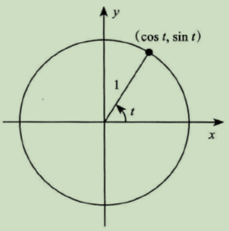

#### 为三角形扇添加一个绘画命令

创建一个接口表示单个绘画命令:
```
 interface DrawCommand{
        void draw();
 }
```
保存绘画命令:
```
 private final List<DrawCommand> drawList = new ArrayList<DrawCommand>();
```
为三角形扇添加绘画命令(appendCircle() 顶部修改代码):
```
   final int startVertex = offset / FLOATS_PRE_VERTEX;
   final int numVertices = sizeOfCircleInVertices(numPoints);

```
appendCircle() 底部:
```
drawList.add(new DrawCommand() {
            @Override
            public void draw() {
                GLES20.glDrawArrays(GLES20.GL_TRIANGLE_FAN,startVertex,numVertices);
            }
 });
```

#### 用三角形带构造圆柱体侧面

用三角形构造这个冰球侧面:
```
  private void appendOpenCylinder(Geometry.Cylinder cylinder,int numPoints){
        final int startVertex = offset / FLOATS_PRE_VERTEX;
        final int numVertices = sizeOfOpenCylinderInVertices(numPoints);

        final float yStart = cylinder.center.y - (cylinder.height/2);
        final float yEnd = cylinder.center.y + (cylinder.height/2);

        //3. 生成三角形带
        /**
         *  p1       p3
         *  | \      |
         *  |  \     |
         *  |    \   |
         *  |      \ |
         *  p2 ----- p4
         */
        for (int i = 0; i <= numPoints; i++) {
            float angleInRadians = ((float) i / (float) numPoints)
                    * ((float) Math.PI * 2f);

            float xPosition = cylinder.center.x
                    +cylinder.radius * (float)Math.cos(angleInRadians);
            float zPosition = cylinder.center.z
                    + cylinder.radius * (float) Math.sin(angleInRadians);

            vertexData[offset++] = xPosition;
            vertexData[offset++] = yStart;
            vertexData[offset++] = zPosition;

            vertexData[offset++] = xPosition;
            vertexData[offset++] = yEnd;
            vertexData[offset++] = zPosition;
        }

        drawList.add(new DrawCommand() {
            @Override
            public void draw() {
                //绘制三角形带
              GLES20.glDrawArrays(GLES20.GL_TRIANGLE_STRIP,startVertex,numVertices);
            }
        });
    }
```
代码中注释3图示:

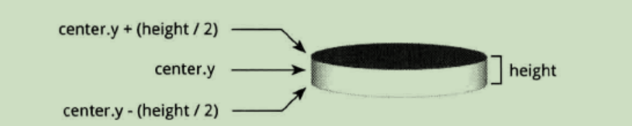

#### 返回生成的数据
返回对象内部生成的数据(GeneratedData):
```
 static class GeneratedData{
        final float[] vertexData;
        final List<DrawCommand> drawList;

        GeneratedData(float[] vertexData,List<DrawCommand> drawList){
            this.vertexData = vertexData;
            this.drawList = drawList;
        }
    }
```
定义build()方法:
```
  private GeneratedData build(){
        return new GeneratedData(vertexData,drawList);
    }
```

#### 用两个圆柱体构造一个木槌
木槌定义:

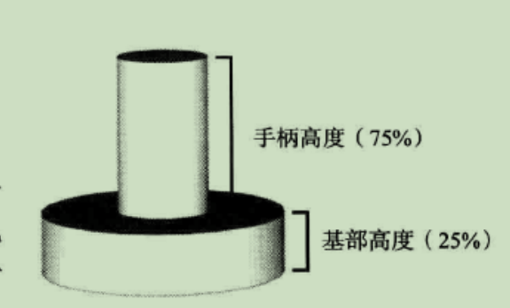
ObjectBuilder中实现createMallet()以创建木槌:

```
    /**
     * 底部一个大低圆柱状底盘
     * 上面一个小高圆柱状手柄
     */
    static GeneratedData createMallet(Geometry.Point center,float radius,
                                      float height,int numPoints){
        int size = sizeOfCircleInVertices(numPoints) *2 +
                sizeOfOpenCylinderInVertices(numPoints) *2;

        ObjectBuilder builder = new ObjectBuilder(size);

        float baseHeight = height * 0.25f;

        Geometry.Circle baseCircle = new Geometry.Circle(
                center.translateY(-baseHeight),
                radius);

        Geometry.Cylinder baseCylinder = new Geometry.Cylinder(
                baseCircle.center.translateY(-baseHeight /2f),
                radius,baseHeight);

        builder.appendCircle(baseCircle,numPoints);
        builder.appendOpenCylinder(baseCylinder,numPoints);

        float handleHeight = height * 0.75f;
        float handleRadius = radius/3f;

        Geometry.Circle handleCircle = new Geometry.Circle(center.translateY(height*0.5f),
                handleRadius);
        Geometry.Cylinder handleCylinder = new Geometry.Cylinder(
                handleCircle.center.translateY(-handleHeight/2f),
                handleRadius,handleHeight);

        builder.appendCircle(handleCircle,numPoints);
        builder.appendOpenCylinder(handleCylinder,numPoints);

        return builder.build();
    }
```
